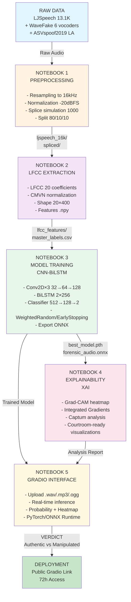

# Forensic Audio Authentication — Deep Learning

> Deep learning-based audio manipulation detection system capable of identifying **authentic recordings**, **spliced audio**, and **voice deepfakes** with integrated forensic explainability (Grad-CAM).

---

## Overview

This project implements a complete **forensic audio authentication pipeline** for forensic experts and security researchers. It covers splice simulation, LFCC feature extraction, CNN-BiLSTM model training, and decision explainability via Grad-CAM, all accessible through a Gradio interface.

| Class | Description |
|---|---|
| `0 — Authentic` | Original unmodified recording |
| `1 — Manipulated` | Simulated splice, vocoder deepfake (WaveFake), or TTS (ASVspoof) |

---

## Pipeline Architecture



---

## Requirements

| Component | Minimum Version |
|---|---|
| Python | 3.10+ |
| CUDA | 11.8+ (recommended) |
| GPU VRAM | 8 GB minimum (T4 Kaggle sufficient) |
| RAM | 16 GB minimum |
| Disk Space | ~50 GB (datasets + features) |

### Required Datasets

| Dataset | Source | Description |
|---|---|---|
| **LJSpeech-1.1** | [keithito/lj_speech](https://huggingface.co/datasets/keithito/lj_speech) | 13,100 authentic voice clips |
| **WaveFake** | [Kaggle WaveFake](https://www.kaggle.com/datasets/birdy654/deep-voice-deepfakes-voice-conversion) | Deepfakes from 6 different vocoders |
| **ASVspoof2019 LA** | [ASVspoof Challenge](https://datashare.ed.ac.uk/handle/10283/3336) | Anti-spoofing dataset, access on request |

---

## Installation & Configuration

### 1. Clone the Repository

```bash
git clone https://github.com/<your-username>/forensic-audio-auth.git
cd forensic-audio-auth
```

### 2. Create Virtual Environment

```bash
python3 -m venv .venv
source .venv/bin/activate          # Linux / macOS
# .venv\Scripts\activate           # Windows
```

### 3. Install Dependencies

```bash
pip install --upgrade pip
pip install torch torchvision torchaudio --index-url https://download.pytorch.org/whl/cu118
pip install \
    numpy==1.26.4 \
    pandas==2.2.2 \
    matplotlib \
    scikit-learn \
    tqdm \
    speechbrain \
    soundfile \
    captum \
    gradio \
    onnxruntime \
    Pillow
```

### 4. Expected Directory Structure

```
forensic-audio-auth/
├── notebooks/
│   ├── 01-preprocessing.ipynb
│   ├── 02-LFCC-extraction.ipynb
│   ├── 03-model-training.ipynb
│   ├── 04-xai-gradcam.ipynb
│   └── 05-gradio-app.ipynb
├── data/
│   ├── LJSpeech-1.1/wavs/          ← LJSpeech .wav files
│   ├── generated_audio/            ← WaveFake by vocoder
│   └── LA/                         ← ASVspoof2019 LA
├── outputs/
│   ├── ljspeech_16k/               ← generated by NB1
│   ├── spliced/                    ← generated by NB1
│   ├── splits/
│   │   └── master_labels.csv       ← generated by NB1
│   ├── lfcc_features/              ← generated by NB2
│   ├── checkpoints/
│   │   └── best_model.pth          ← generated by NB3
│   └── models/
│       └── forensic_audio.onnx     ← generated by NB3
└── README.md
```

---

## Usage Guide

Notebooks must be **executed in order**. Each notebook consumes the outputs of the previous one.

### Step 1 — Audio Preprocessing

```bash
jupyter notebook notebooks/01-preprocessing.ipynb
```

**Produces:**
- `outputs/ljspeech_16k/` — clips resampled to 16 kHz
- `outputs/spliced/` — 1,000 simulated spliced clips
- `outputs/splits/master_labels.csv` — unified index with 80/10/10 splits

**Estimated Duration:** 30–45 min on GPU

---

### Step 2 — LFCC Feature Extraction

```bash
jupyter notebook notebooks/02-LFCC-extraction.ipynb
```

**Produces:**
- `outputs/lfcc_features/*.npy` — LFCC matrices (20, 400) per clip
- `outputs/master_labels_with_features.csv` — enriched CSV with .npy paths

**Estimated Duration:** 45–60 min on GPU

---

### Step 3 — CNN-BiLSTM Model Training

```bash
jupyter notebook notebooks/03-model-training.ipynb
```

**Produces:**
- `outputs/checkpoints/best_model.pth` — best checkpoint (val_loss)
- `outputs/models/forensic_audio.onnx` — model exported for deployment
- `outputs/results/metrics.csv` — EER, FAR@1%FRR, AUC-ROC
- `outputs/training_curves.png` / `confusion_matrix.png`

**Estimated Duration:** 1h30–2h on GPU

---

### Step 4 — Grad-CAM Explainability & SHAP

```bash
jupyter notebook notebooks/04-xai-gradcam.ipynb
```

**Produces:**
- `outputs/xai/gradcam_*.png` — heatmaps for each analyzed clip
- `outputs/xai/shap_*.png` — importance of LFCC coefficients
- `outputs/xai/courtroom_*.png` — court-ready visualizations
- `outputs/xai/splice_validation.png` — localization validation on known splice

**Estimated Duration:** 30–45 min on GPU

---

### Step 5 — Gradio Interface

```bash
jupyter notebook notebooks/05-gradio-app.ipynb
```

Then in the launch cell:

```python
# Launch interface with public link (valid 72h)
demo.launch(share=True)
```

The interface accepts `.wav`, `.flac`, `.mp3`, `.ogg` formats and returns:
- Verdict (Authentic / Manipulated)
- Probability of manipulation (%)
- Grad-CAM heatmap overlaid on LFCC spectrogram
- Exportable text report

---

## Configuration

Global parameters are defined at the head of each notebook. Critical variables to adapt to your environment:

### Dataset Paths

```python
# In 01-preprocessing.ipynb and 02-LFCC-extraction.ipynb
LJSPEECH_DIR  = Path('/path/to/LJSpeech-1.1/wavs')
WAVEFAKE_DIR  = Path('/path/to/generated_audio')
ASVSPOOF_DIR  = Path('/path/to/LA')
OUTPUT_DIR    = Path('/path/to/outputs')
```

### Audio Parameters

```python
SAMPLE_RATE    = 16000    # Target sampling rate (Hz)
CLIP_DURATION  = 4        # Fixed clip duration (seconds)
N_LFCC         = 20       # Number of LFCC coefficients
N_FFT          = 400      # FFT window size (25 ms at 16 kHz)
HOP_LENGTH     = 160      # Window hop (10 ms at 16 kHz)
N_FILTER       = 128      # Number of linear filter banks
N_SPLICES      = 1000     # Number of spliced clips to simulate
```

### Training Hyperparameters

```python
BATCH_SIZE     = 32
LEARNING_RATE  = 1e-3
N_EPOCHS       = 20
EARLY_STOPPING = 5        # Patience in number of epochs
GRAD_CLIP      = 1.0
```

### Execution on Kaggle

If running on Kaggle, adapt the base paths:

```python
BASE     = Path('/kaggle/input/<your-username>/<dataset-name>')
OUTPUT_DIR = Path('/kaggle/working')
```

Enable GPU in **Settings → Accelerator → GPU T4 x2** before executing.

---

## Target Metrics

| Metric | Objective |
|---|---|
| EER (Equal Error Rate) | < 5% |
| AUC-ROC | > 0.95 |
| FAR @ 1% FRR | < 3% |
| Accuracy (test set) | > 95% |

---

## Contributors

| Name | Role |
|---|---|
| **[Name 1]** | Deep learning modeling, training, XAI |
| **[Name 2]** | Audio preprocessing, splice simulation, Gradio interface |

---

## License

This project is developed in an academic context. The datasets used (LJSpeech, WaveFake, ASVspoof2019) are subject to their respective licenses — consult the original sources before any commercial use.
